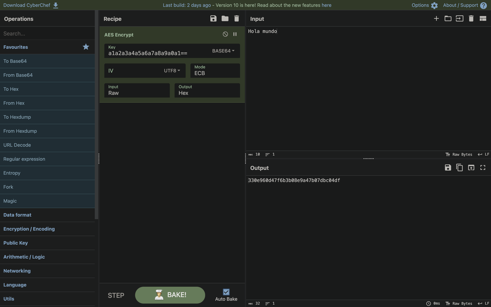
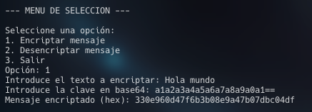
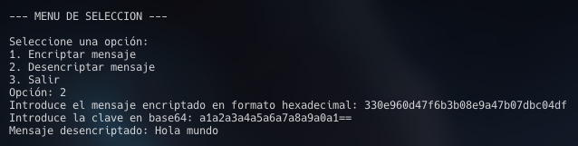

# Instrucciones para ejecutar el script

Estas son las instrucciones para ejecutar el script `script.py`.

## Paso 1: Crear un entorno virtual (venv)
Primero, crea un entorno virtual utilizando `venv`. Esto te ayudará a mantener las dependencias del proyecto aisladas del sistema global de Python.

```bash
python3 -m venv venv-prueba
```

## Paso 2: Activar el entorno virtual
En macOS y Linux:
```bash
source venv/bin/activate
```
En Windows
```bash
cd ruta\al\script\venv\Scripts

activate
```

## Paso 3: Instalar dependencias
Una vez que el entorno virtual esté activado, instala las dependencias del proyecto desde el archivo `requirements.txt`

```bash
pip install -r requirements.txt
```

## Paso 4: Ejecutar el script
En macOS y Linux:
```bash
python3 script.py
```
En Windows
```bash
python script.py
```

Se recomienda comprobar que el encriptado sea correcto en:
[CyberChef](https://gchq.github.io/CyberChef/)

Se ha estado utilizado para las pruebas la key
```
a1a2a3a4a5a6a7a8a9a0a1==
```
### Se utilzia el método AES
Se recibe la key en base64 y el mensaje encriptado en hex. El modo actualmente utilizado
en este script es ECB



